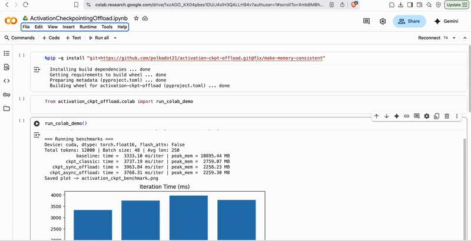

# Activation Checkpointing with CPU Offload (sync/async)

This repo provides:
- **Classic activation checkpointing** (no `torch.utils.checkpoint`)
- **Checkpointing + CPU Offload (sync)**
- **Checkpointing + CPU Offload (async)** using **pinned RAM + CUDA stream + event**
Additionally:
- **Correctness** tests (gradient parity vs baseline)
- **Benchmarks** (ms/iter + peak GPU MB)
- **Memory timeline plots** showing forward ramp (classic) vs **no ramp** (offload)

Works on **CPU** (with a tiny set) and **CUDA**. 
`FlashAttention` is optional and automatically skipped on unsupported GPUs (e.g., T4).

## Compatibility & OS notes

> **TL;DR**
> - ✅ Linux (Ubuntu/Colab) — fully supported.
> - ⚠️ macOS — **`make cpu` is not supported**.
> - ⚠️ Windows — not tested; no guarantee it works out-of-the-box. Prefer WSL2.

#### macOS
PyTorch on macOS prefers the **MPS** backend (Apple GPU). Even when you pass `--device cpu`, some ops (e.g., `rms_norm` and friends) can still dispatch to MPS, and on many builds the required MPS kernels are missing → runtime errors like:

```bash
DispatchStub: missing kernel for mps
```

Just use Colab to reproduce.

## Quickstart with uv

```bash
# 1) Install uv if you don't have it
curl -LsSf https://astral.sh/uv/install.sh | sh

# 2) Sync deps
uv sync

# 3) Run a benchmark & save plots
uv run -m activation_ckpt_offload --device cuda \
  --total_tokens 12000 --num_layers 12 --hidden_dim 1024 --head_dim 64 \
  --ff_dim 4096 --batch_size 48 --steps 3
```

Outputs:

- `activation_ckpt_benchmark.png` – bars for time & peak GPU memory

- `memory_timeline.png` – Matplotlib timelines (classic, sync offload, async offload)

## One-cell Google Colab (free T4)

```bash
# Colab cell
%pip -q install "git+https://github.com/<YOUR_GH_USER>/activation-ckpt-offload.git"
from activation_ckpt.colab import run_colab_demo
run_colab_demo()  # runs benchmarks & timelines on CUDA if available
```



## CLI

```bash
uv run -m activation_ckpt --help
uv run -m activation_ckpt --device cuda --total_tokens 12000 --num_layers 12 \
  --hidden_dim 1024 --head_dim 64 --ff_dim 4096 --batch_size 48 --steps 3
```

## Dev

```bash
make sync
make fmt
make lint
```

## Results

#### Benchmark (Colab T4, fp16, 12k tokens, 12 layers, hidden=1024, ff=4096, batch=48)

| Mode               | Time (ms/iter) | Δ vs Baseline | Peak GPU (MB) | Δ vs Baseline | Δ vs Ckpt Classic |
|--------------------|---------------:|--------------:|--------------:|--------------:|------------------:|
| baseline           |       3347.69  | —             |   10895.44    | —             | —                 |
| ckpt_classic       |       3745.56  | **+11.88%**   |    2759.07    | **−74.68%**   | —                 |
| ckpt_sync_offload  |       3949.46  | **+17.98%**   |    2258.23    | **−79.27%**   | **−18.15%**       |
| ckpt_async_offload |       3762.83  | **+12.40%**   |    2260.00    | **−79.26%**   | **−18.09%**       |

**Notes**
- Checkpointing cuts peak GPU memory by **~75%** with a **~12%** time penalty.
- Offloading checkpoint inputs to CPU trims another **~18%** off checkpointing’s peak (down to ~2.26 GB).
- **Async offload** overlaps D2H/H2D with compute, so it’s **~4.7% faster than sync** (3949.46 → 3762.83 ms/iter) while achieving the same low peak memory.


#### Memory timelines

- The memory timelines align with expectations:  
  - **ckpt_classic** shows a forward **linear ramp** (accumulating inputs on GPU) then a backward sawtooth.  
  - **ckpt_sync_offload/ckpt_async_offload** show **no forward ramp**; only backward sawtooth as inputs are reloaded.  
  - Async’s forward footprint is lower than sync because copies run on a **separate CUDA stream**, letting compute-stream temporaries be **freed/reused earlier**.

